
| Name           | NRP        | Kelas     |
| ---            | ---        | ----------|
| Alief Gilang Permana Putra | 5025221193 | Jaringan Komputer (B) |
| Mu'aafii Putra Ramadhan | 5025221135 | Jaringan Komputer (B) |

## Task 1

> a. Berapa banyak packet yang terekam pada file pcapng?

> _a. How many packets are recorded in the pcapng file?_

**Answer:**

- Flag

  `JARKOM24{K4mu_K3r3n_5MVT9QQIHT1JVOSME7ZC0D9KE4ETW90xL4ughzsqodw7moiq3y5rdlutcaa1}`

- Filter expression

  `Statistics -> packet lengths`
  
- Explanation

  `Ketika melakukan hal tersebut, terlihat count dari semua packetnya`
  `Selain itu terlihat juga di bagian kanan bawah mengenai total packet yg ada, yaitu 1089`

- Output result

  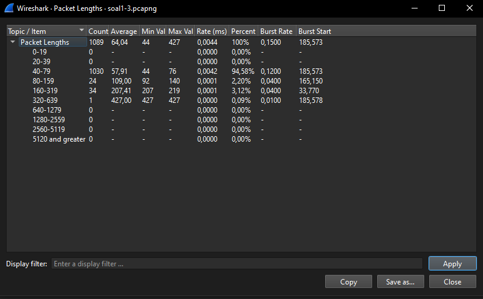
  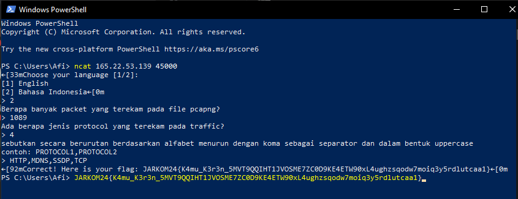

 
 

> b. Ada berapa jenis protocol yang terekam pada traffic

> _b. How many types of protocols are recorded in the traffic?_

**Answer:**

- Flag

  `JARKOM24{K4mu_K3r3n_5MVT9QQIHT1JVOSME7ZC0D9KE4ETW90xL4ughzsqodw7moiq3y5rdlutcaa1}`

- Filter expression

  `Statistics -> protocol hierarchy`
  
- Explanation

  `Dalam protocol hieararchy, ditampilkan protocol yang digunakan pada iPv4 dan iPv6. Pada iPv4 terdapat SSDP dan TCP, pada iPv6 terdapat MDNS dan HTTP.`

- Output result

  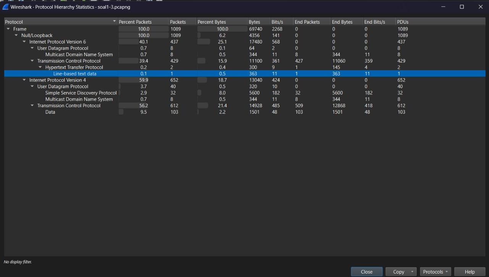

 
 

> c. Sebutkan secara berurutan berdasarkan alfabet menurun dengan koma sebagai separator, contoh: protocol1,protocol2

> _c. List the protocols in descending alphabetical order, separated by commas. Example: protocol1,protocol2_

**Answer:**

- Flag

  `JARKOM24{K4mu_K3r3n_5MVT9QQIHT1JVOSME7ZC0D9KE4ETW90xL4ughzsqodw7moiq3y5rdlutcaa1}`

- Filter expression

  `Statistics -> protocol hierarchy`
  
- Explanation

  `Dalam protocol hirearchy terlihat protocol yang digunakan pada iPv4 dan iPv6. Setelah itu tinggal diurutkan mengikuti alphabet, HTTP, MDNS, SSDP, TCP`

- Output result

  

## Task 2

> a. Berapa banyak packet berbasis TCP yang memiliki flag [RST, ACK]

> _a. How many TCP based packets have the flags [RST, ACK]?_

**Answer:**

- Flag

  `JARKOM24{W0w_4nother_Sh0t_PHGBESGFSLH0mptyczbqkpoddaqueaydpgebM4r170559369282280746040}  `

- Filter expression

  `tcp.flags.ack==1&&tcp.flags.reset==1`
  
- Explanation

  `Setelah menaruh filter tersebut, akan memunculkan flag yang tersangkut, yaitu ketika memiliki keduanya baik flag [ACK] dan [RST]. Setelah di filter, bisa periksa di bagian bawah berap yang terdisplay setelah terfilter.`

- Output result

  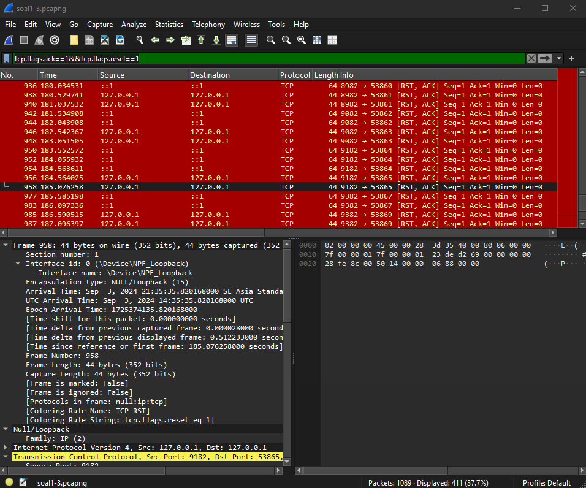
  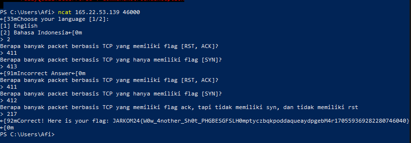

 
 

> b. How many TCP based packets have only the [SYN] flag?

> _b. How many TCP based packets have only the [SYN] flag?_

**Answer:**

- Flag

  `JARKOM24{W0w_4nother_Sh0t_PHGBESGFSLH0mptyczbqkpoddaqueaydpgebM4r170559369282280746040}`

- Filter expression

  `tcp.flags.syn==1&&tcp.flags.ack==0`
  
- Explanation

  `Jika hanya memfilter flag [SYN], akan ada 1 packet yang menyangkut juga flag [ACK], maka dari itu, lakukan juga filter pada flag [ACK] agar hanya flag [SYN] yang muncul. Setelah itu bisa dilihat berapa packet yang terdisplay`

- Output result

  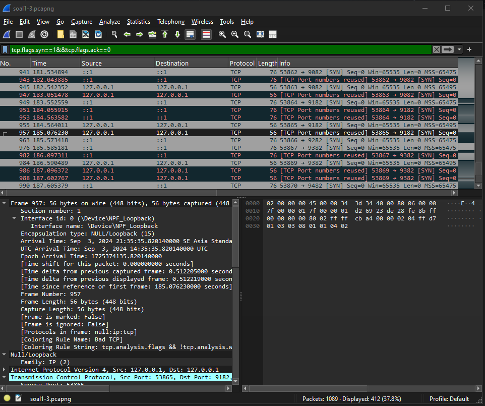

 
 

> c. How many TCP based packets have the ACK flag but do not have SYN or RST?

> _c. How many TCP based packets have the ACK flag but do not have SYN or RST?_

**Answer:**

- Flag

  `Put your flag in here`

- Filter expression

  `tcp.flags.syn==0&&tcp.flags.ack==1&&tcp.flags.reset==0`
  
- Explanation

  `Gunakan flter tersebut, lalu cek kounter berapa packet yang terdisplay`

- Output result

  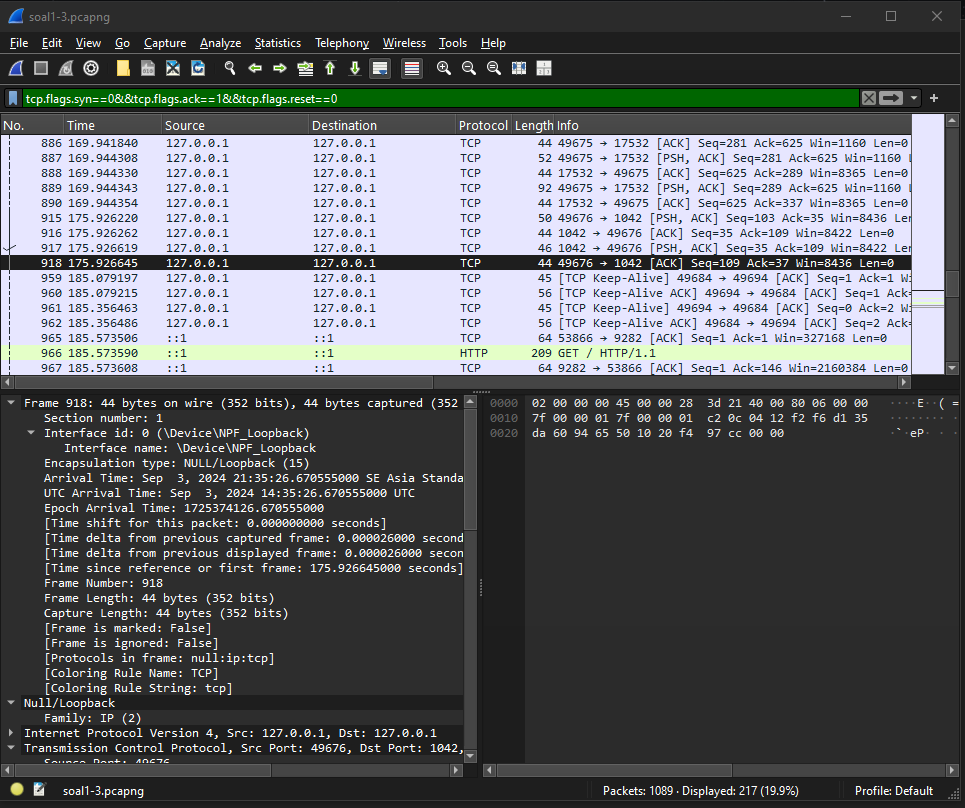

 
 

## Task 3

> a. Pada port berapa server http terbuka?

> _a. On which port is the HTTP server open?_

**Answer:**

- Flag

  `JARKOM24{Y0u_4r3_4_g00d_4nalyz3r_XU710L1ts4nzuf9jlpk11dubqxxumvn}`

- Filter expression

  `http`
  
- Explanation

  `Kita bisa melihat package nomor 966 yang melakukan request GET dengan melihat detail pada detail Hypertext Transfer Protocol bagian Host, maka akan terlihat port yang dipakai localhost yaitu 9282. Atau kita dapat melihat pada detail Transmission Control Protocol bagian Dst Port menuju 9282`

  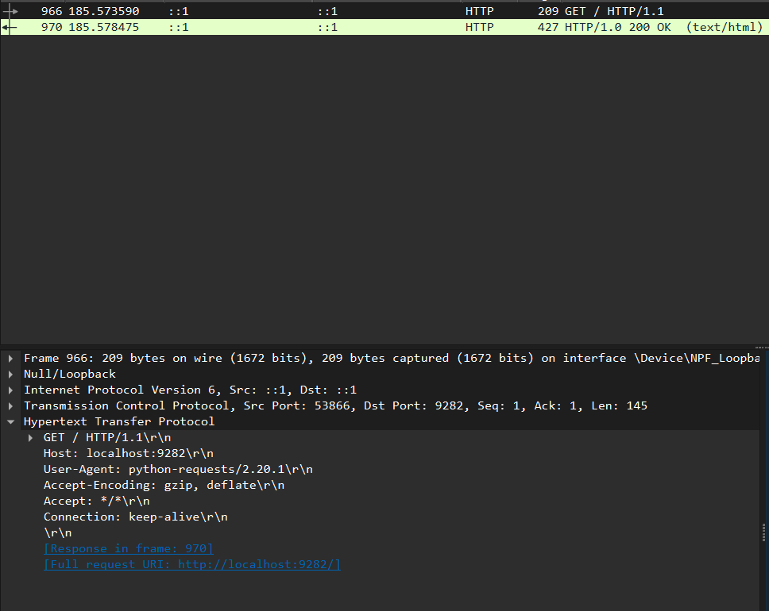

- Output result

  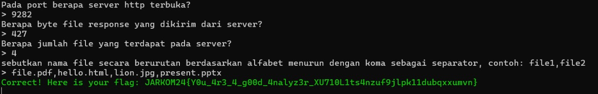

 
 

> b. Berapa byte file response yang dikirim dari server

> _b. How many bytes of file response are sent from the server?_

**Answer:**

- Flag

  `JARKOM24{Y0u_4r3_4_g00d_4nalyz3r_XU710L1ts4nzuf9jlpk11dubqxxumvn}`

- Filter expression

  `http.response.code == 200`
  
- Explanation

  `Kita bisa melihat byte/length paket http yang dikirimkan server dengan melakukan filtering paket yang mengirimkan http response code 200 atau OK`

  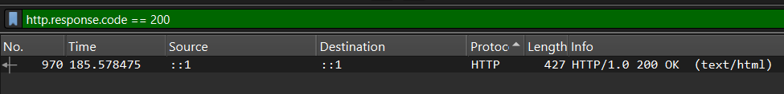

- Output result

  

 
 

> c. Berapa jumlah file yang terdapat pada server?

> _c. How many files are there on the server?_

**Answer:**

- Flag

  `JARKOM24{Y0u_4r3_4_g00d_4nalyz3r_XU710L1ts4nzuf9jlpk11dubqxxumvn}`

- Filter expression

  `http.response.code == 200`
  
- Explanation

  `Dengan melihat paket yang sama seperti 3a, kita dapat melihat detail HTTP bagian Line-based text data bahwa data yang dikirimkan adalah html yang memberikan directory listing server sehingga kita dapat melihat seluruh file yang terdapat pada server. Dapat dilihat terdapat 4 baris tag <li> yang bernama suatu file sehingga jumlah file yang terdapat pada server adalah 4(empat)`

  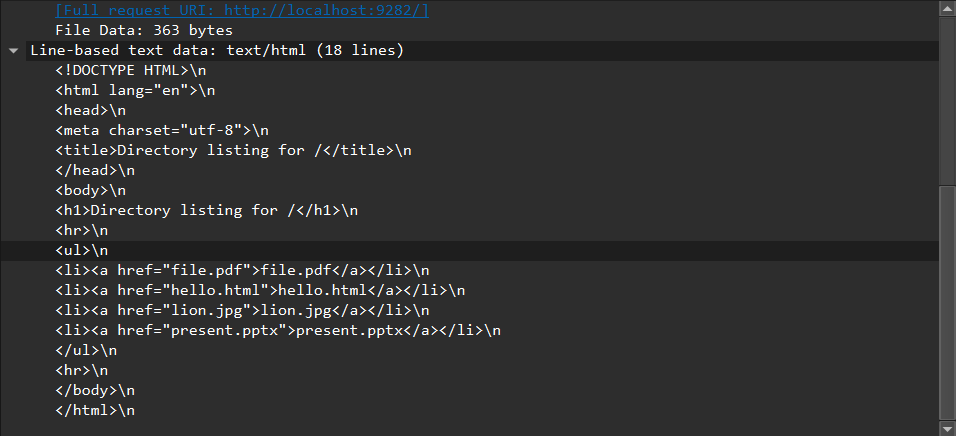

- Output result

  

 
 

> c. Sebutkan nama file secara berurutan berdasarkan alfabet menurun dengan koma sebagai separator, contoh: file1,file2

> _c. List the filenames in descending alphabetical order, separated by commas. Example: file1,file2_

**Answer:**

- Flag

  `JARKOM24{Y0u_4r3_4_g00d_4nalyz3r_XU710L1ts4nzuf9jlpk11dubqxxumvn}`

- Filter expression

  `http.response.code == 200`
  
- Explanation

  `Sama seperti 3b, kita tinggal menuliskan nama file sesuai dengan urutan abjad menurun`

- Output result

  

 
 

## Task 4

> Protokol apa yang paling banyak terdapat di file hasil capture traffic?

> _Which protocol is the most frequent in the traffic capture file?_

**Answer:**

- Flag

  `JARKOM24{M4ster_4n4lyzer_68485t1k1OEBQFSWLPSR41sxus828ah84}`

- Filter expression

  `Statistics -> protocol hierarchy`
  
- Explanation

  `Pada protocol hirearchy, terlihat jelas bahwa seluruh packet merupakan packet FTP`

- Output result

  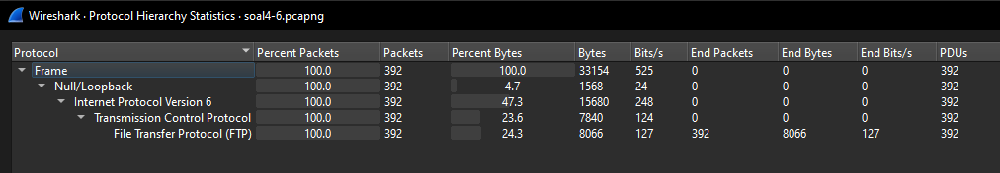
  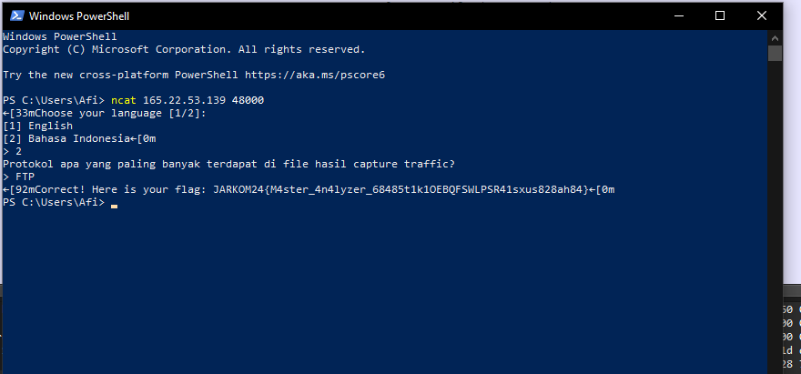

 
 

## Task 5

> Berdasarkan hasil bruteforce, apa user yang tepat dari hasil bruteforce?

> _Based on the brute force results, what is the correct username?_

**Answer:**

- Flag

  `JARKOM24{He_1s_g3d4g3d1g3d4g3d40_JCWXEWYWCMZLPRGGTOXIMunskycvhtxshtlyt450001395241}`

- Filter expression

  `ftp.response.code == 230`
  
- Explanation

  `Kode login berhasil untuk FTP adalah 230, sehingga kita mencari paket yang mengirimkan response code 230. Setelah paket ditemukan, untuk mendapatkan user yang tepat, kita dapat melakukan Follow TCP Stream pada paket tersebut, maka kita mendapatkan user yang tepat yaitu gedagedigedagedao`

  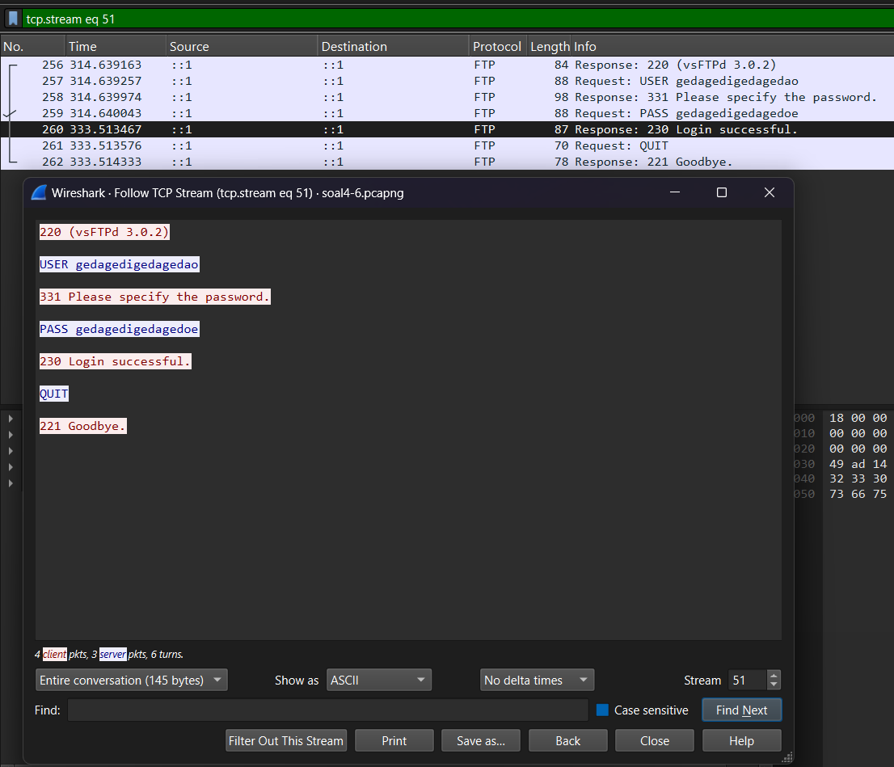

- Output result

  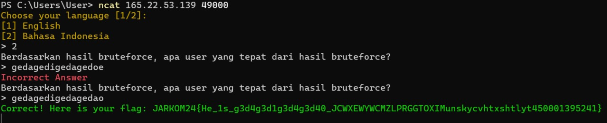

 
 

## Task 6

> Apa password yang tepat?

> _What is the correct password?_

**Answer:**

- Flag

  `JARKOM24{h1s_fr1end_1s_g3d4g3d1g3d4g3d03_IKNFJ45QMTyksnUmhgmzeizexaB4Sur1VLIUWKPSIM}`

- Filter expression

  `ftp.request.command =="PASS" ||ftp.response.code==230`
  `password = gedagedigedagedoe`
  
- Explanation

  `Jika hanya menggunakan filter untuk mencari password saja, akan sulit untuk menemukan password yang berhasil. Jika hanya mencari waktu ketika login succesful, password yang dipakai tidak ditampilkan. Maka dari itu, filter keduanya berbarengan tapi tidak menggunakan "dan(&&)".`

- Output result

  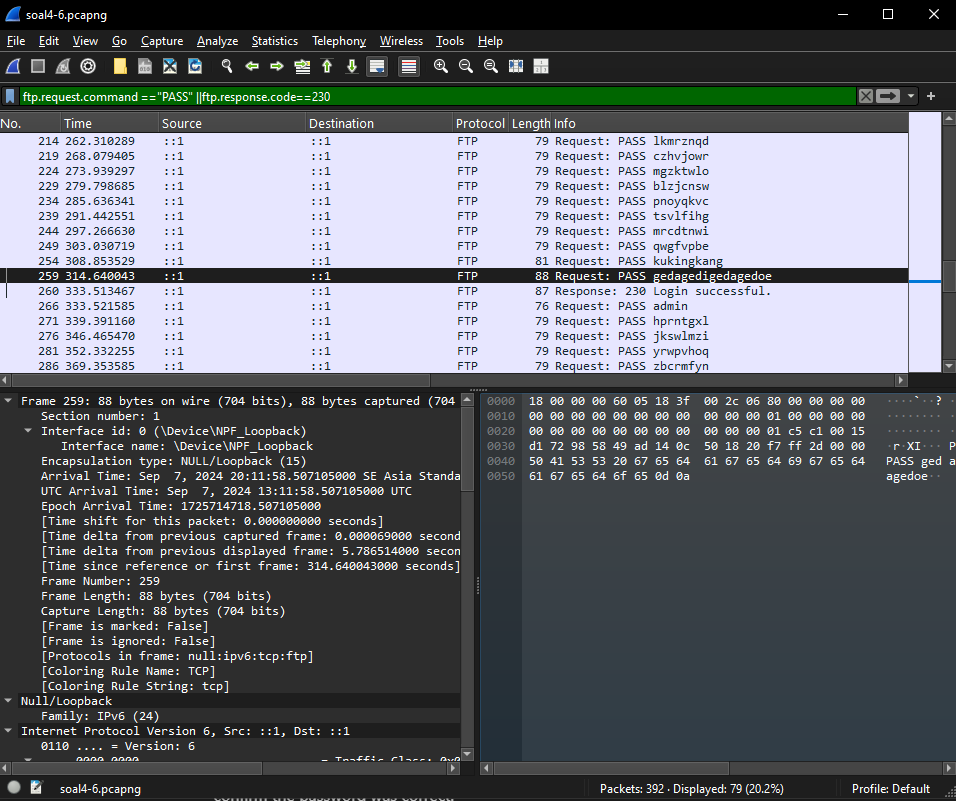
  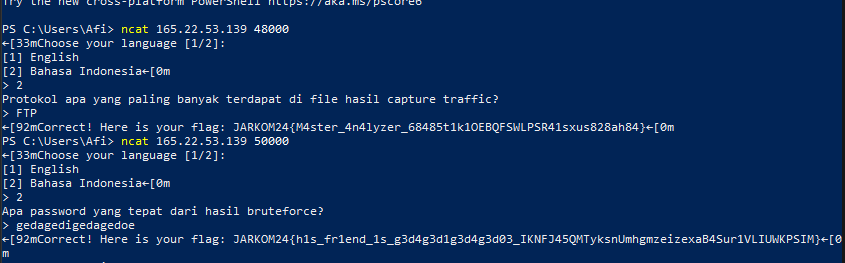

 
 

## Task 7

> Pada port berapa telnet yang bisa diakses?

> _On which port is Telnet accessible?_

**Answer:**

- Flag

  `JARKOM24{Gr34t_Sn1ff3r_6KLSNyksnUm4v7tilwpa4T3t0t1SeXEOAd4A}`

- Filter expression

  `tcp.len > 1`
  
- Explanation

  `Untuk mencari port telnet, kita dapat mencari satu-satu dengan bantuan filter tcp.len > 1 karena telnet biasanya mengirimkan data sehingga tidak mungkin ukuran datanya kurang dari sama dengan 1. Kita dapat mencari satu-satu paket yang mempunyai string/isi "telnet" pada bytes paket. Kemudian kita dapat melihat Src Port dan Dst Port. Karena tidak dijelaskan src dan dst telnet yang dimaksud, kita bisa mencoba kedua port tersebut sehingga didapatkan port 2423 adalah port telnet yang dimaksud`

  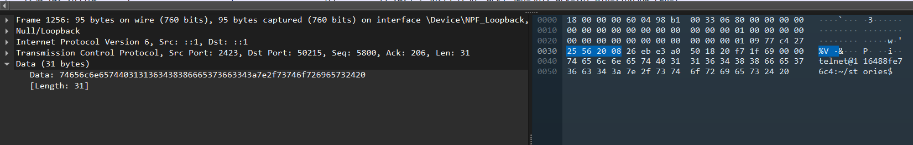

- Output result

  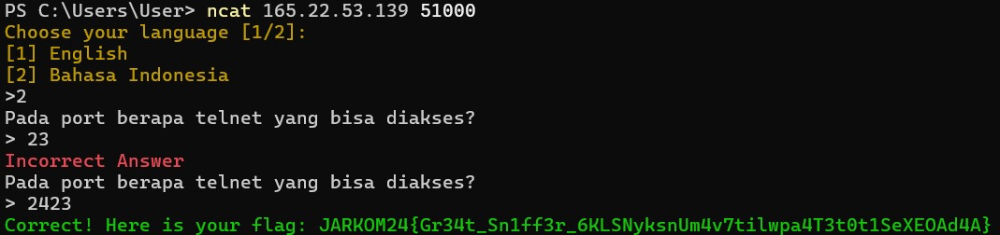

 
 

## Task 8

> Ada berapa file di dalam server?

> _How many files are on the server?_

**Answer:**

- Flag

  `JARKOM24{P4ck3t_4n4lyz3r_tt9xqauohq3112vhypfihdntS1SIXQBCHRNTH}`

- Filter expression

  `tcp.stream eq 32`
  
- Explanation

  `Masih berhubungan dengan no 7, kita dapat melakukan follow TCP stream pada paket telnet tadi, dan kita mencari command "ls" pada tab TCP stream. Pada paket 1178 kita mendapatkan response yang mengembalikan list file pada server tersebut. Setelah dihitung, terdapat 7 file pada server tersebut`

  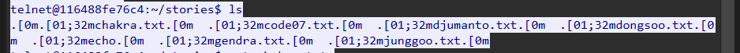

- Output result

  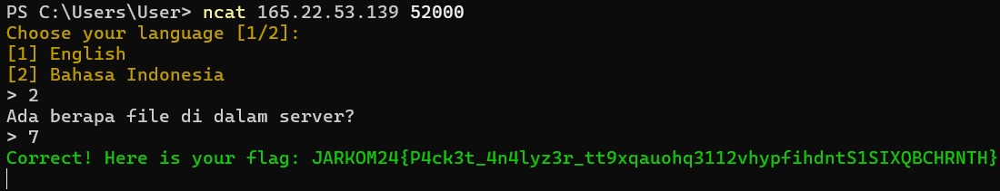

 
 

## Task 9

> Apa nama file yang dieksekusi oleh user?

> _What is the name of the file executed by the user?_

**Answer:**

- Flag

  `JARKOM24{333ch000_us3r_646114235512LeSJIQyhQGd33dXVZETRPG50}`

- Filter expression

  `tcp.stream eq 32`
  
- Explanation

  `Dengan TCP stream yang sama seperti nomor 8, kita harus teliti mencari file yang dieksekusi. Biasanya file yang dieksekusi diawali dengan "./". Setelah diteliti maka kita menemukan nama file yang dieksekusi adalah echo`

  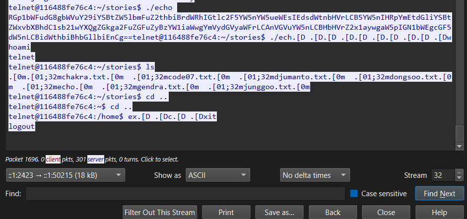

- Output result

  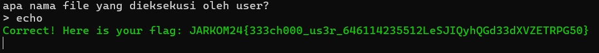

 
 

## Task 10

> Apa output dari file dalam bentuk base64 decode?

> _What is the output of the file in base64-decoded form?_

**Answer:**

- Flag

  `JARKOM24{tH4ts_1t_w3ll_d0n3_55300809451337401myukoc51231421421VFJLXV6H27X275H}`

- Filter expression

  `tcp.stream 32`
  
- Explanation

  `Dibawah perintah echo, terdapat string random, kita copy string tersebut dan gunakan command echo "String" | base64 --decode pada linux/wsl. Maka kita mendapatkan hasil string seperti dibawah`

  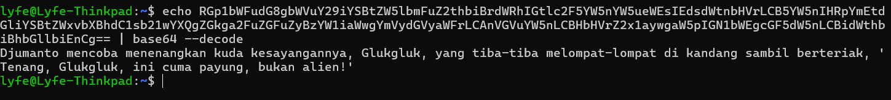

- Output result

  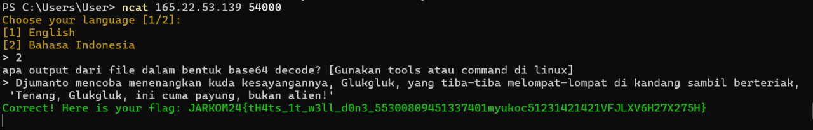

 
 

## Summary

Untuk menganalisis paket, kita dapat memanfaatkan fitur Statistic tab, filter dan follow stream untuk membantu mencari paket yang diinginkan. Selain itu, bisa juga untuk mencari flag pada yang digunakan pada paket dan juga dapat melihat isi bytes dari paket secara manual sehingga kita dapat menemukan string yang dimaksud.

## Problems

